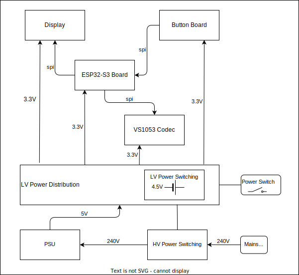

# Rusty Radio

An embedded internet radio written in Rust. 

 [!WARNING]
 Under construction

The radio can accept the following formats:
* MP3
* AAC 
* M3U (WORK IN PROGRESS!)

## System Diagram

## Hardware 

*  Uses the Seeed Studio [XIAO ESP32C3](https://wiki.seeedstudio.com/XIAO_ESP32C3_Getting_Started/) as this has an external antenna meaning that the radio is independent of the enclosure used. 
    * Intially used the [ESP32-C3-DevKitM-1](https://docs.espressif.com/projects/esp-dev-kits/en/latest/esp32c3/esp32-c3-devkitm-1/user_guide.html#) board.

* Schematics are created using KiCad 9.0.

## Software Architecture

- The system uses esp-hal and [embassy](https://dev.to/theembeddedrustacean/embassy-on-esp-getting-started-27fi) for task scheduling. 

- The project was initially generated  with `cargo generate esp-rs/esp-template`. See the [GitHub repo](https://github.com/esp-rs/esp-template). The software project root is `controller`.

## Development Notes

- ESP Rust installation set up environment variable.  A file was created at `C:\Users\T440s\export-esp.ps1` showing the injected environment variables. 

- Embassy code examples taken from https://github.com/esp-rs/esp-hal/tree/main/examples/src/bin

- How to use Embassy in the [Embassy Book](https://embassy.dev/book/)

