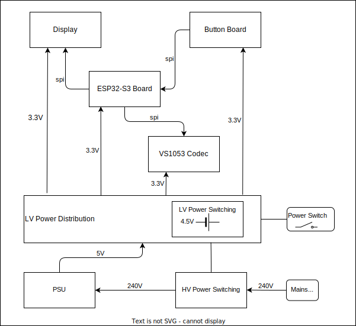

# Rusty Radio

An embedded internet radio written in Rust.

> **⚠️ Work In Progress**
>
> This project is under active development. Features, hardware, and software may change frequently. 

## Supported Formats

Rusty Radio currently supports:
- MP3
- AAC
- M3U

## System Diagram

## Hardware
 - For the radio uses the Seeed Studio [XIAO ESP32C-C3](https://wiki.seeedstudio.com/XIAO_ESP32C3_Getting_Started/) for its external antenna, making the radio independent of the enclosure.
 - For the user interface (display, tuning knob and preset buttons) uses another XIAO ESP32-C3 which communicates over an UART interface with the radio processor. 
   This approach was chosen as using C3 (or for that matter, a S3) for both the radio and the display led to memory issues.  
- Uses the VS1053 chip to decode the streamed audio.
- Schematics are created using KiCad 9.0.

## Software Architecture

- Built with `esp-hal` and [Embassy](https://dev.to/theembeddedrustacean/embassy-on-esp-getting-started-27fi) for async task scheduling.
- Project scaffolded using `cargo generate esp-rs/esp-template`. See the [GitHub repo](https://github.com/esp-rs/esp-template). The software project root is `controller`.

## Development Notes

- Embassy code examples are referenced from [esp-hal examples](https://github.com/esp-rs/esp-hal/tree/main/examples/src/bin).
- For more on Embassy, see the [Embassy Book](https://embassy.dev/book/).

---

