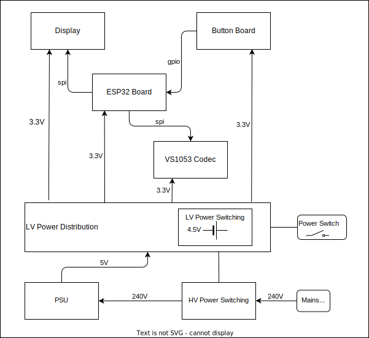

An interim internet radio module. 

# System Diagram

# Notes
- Use Embassy (see [Embassy on ESP: Getting Started ](https://dev.to/theembeddedrustacean/embassy-on-esp-getting-started-27fi))

- ESP Rust installtion set up environment variable.  A file was created at 'C:\Users\T440s\export-esp.ps1' showing the injected environment variables. 

- Generated rust project with `cargo generate esp-rs/esp-template`. See the [GitHub repo](https://github.com/esp-rs/esp-template). Project is called `controller`.

- Embassy code examples taken from https://github.com/esp-rs/esp-hal/tree/main/examples/src/bin

- Using the [ESP32-C3-DevKitM-1](https://docs.espressif.com/projects/esp-dev-kits/en/latest/esp32c3/esp32-c3-devkitm-1/user_guide.html#) board 